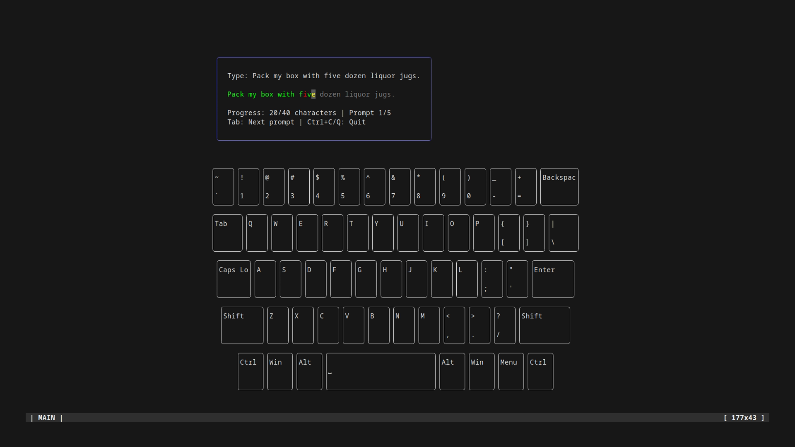
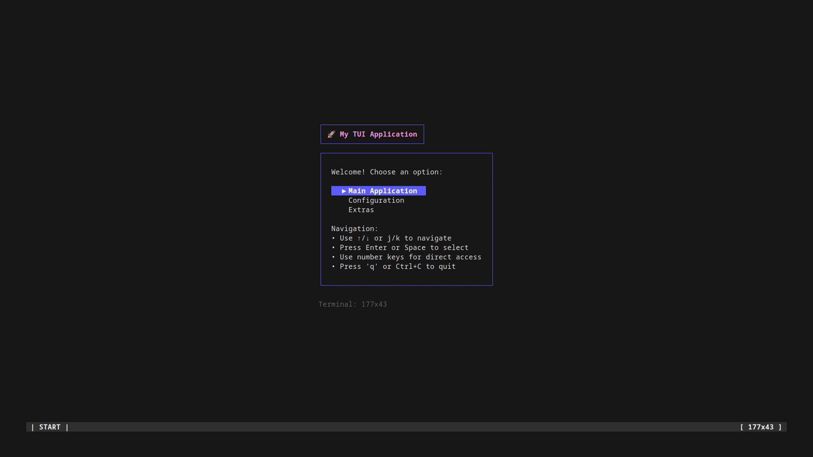

# typr2

A TUI typing tutor written in Go.

A re-write and re-imagining of the original [typr](https://sr.ht/~berts/typr/) project.

## Demo

## Project

**Note: This is a work-in-progress for the purposes of teaching myself Golang. I welcome 
any code reviews or pull requests for code improvements.**

You can read the [TODO.md](TODO.md) for current feature plans and status.
